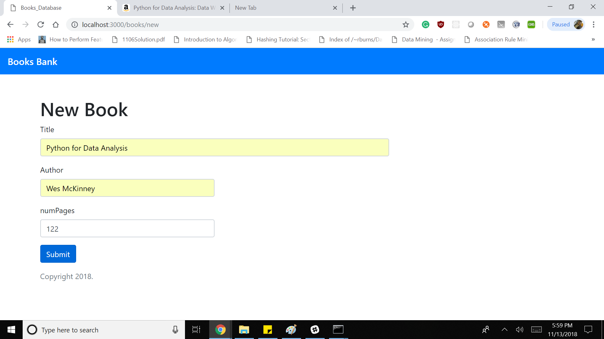
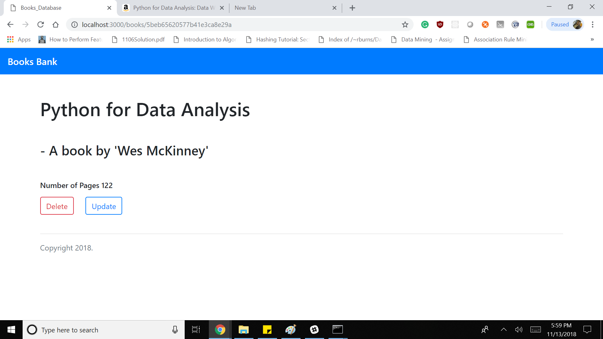

# Description

As a user of your application  
I want to be able to manage books  
So that I can keep a record of the books  
Acceptance Criteria  

Must expose the functionality from the previous assignment through a user interface. i.e. GET /book/{bookId} should show a page listing the book details in an easy to read format. 
Other Details

# Ouptut

## Add New Book 

#New Book Added

## Update Book

## Delete Book

## View Books

